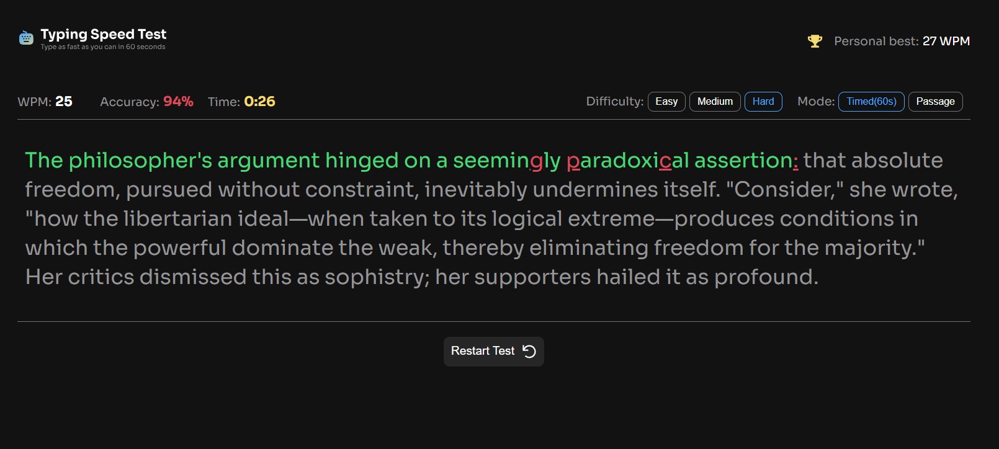

# Frontend Mentor - Typing Speed Test solution

This is a solution to the [Typing Speed Test challenge on Frontend Mentor](https://www.frontendmentor.io/challenges/typing-speed-test). Frontend Mentor challenges help you improve your coding skills by building realistic projects.

## Table of contents

- [Overview](#overview)
  - [The challenge](#the-challenge)
  - [Screenshot](#screenshot)
  - [Links](#links)
- [My process](#my-process)
  - [Built with](#built-with)
  - [What I learned](#what-i-learned)
  - [Continued development](#continued-development)
  - [Useful resources](#useful-resources)
  - [AI Collaboration](#ai-collaboration)
- [Author](#author)

## Overview

### The challenge

Users can:

- Start a test by clicking the "Start Typing Test" button or by clicking directly on the passage text and typing
- Choose a difficulty level (Easy, Medium, Hard) to get passages of varying complexity
- Switch between Timed (60s countdown) mode and Passage (counts up, untimed) mode
- Restart at any time — including mid-test — and get a new random passage
- See real-time WPM, accuracy, and time stats while typing
- See live visual feedback: correct characters in green, incorrect characters in red with an underline
- Correct mistakes with backspace
- View results (WPM, accuracy, characters correct/incorrect) after completing a test
- See distinct result screens: "Baseline Established!" on their first test, "High Score Smashed!" with confetti when beating their personal best, and "Test Complete!" otherwise
- Have their personal best persist across sessions via `localStorage`
- Use the full app on both mobile (via a dropdown menu for difficulty/mode) and desktop layouts
- See hover and focus states on all interactive elements

### Screenshot



### Links

- Solution URL: [View on GitHub](https://github.com/ahmad-wdev/typing-speed-test-app)

- Live Site URL: [View Live](https://typing-speed-test-sj.netlify.app/)

## My process

### Built with

- Semantic HTML5 markup
- CSS custom properties (variables) for the color palette
- Flexbox for layout
- Mobile-first responsive design with a media query breakpoint at 768px
- Vanilla JavaScript (DOM manipulation, event handling, the Fetch API, `localStorage`)

### What I learned

This project pushed me to go deeper with vanilla JavaScript DOM work than I had before. A few things that stood out:

**`querySelectorAll` returns every match, not just the visible one.** Since my result data (WPM, accuracy, characters) needed to update identical elements across three different result screens, I had to loop through a full `NodeList` with `forEach` instead of relying on `querySelector`, which only grabs the first match in the DOM:

```js
let wpmResultArray = Array.from(document.querySelectorAll(".wpm-span-result"));
wpmResultArray.forEach((element) => {
  element.textContent = currentWpm;
});
```

**State needs to be fully reset between tests, not just visually.** My timer kept freezing after clicking "Restart" or "Go Again" mid-test — the bug was that a boolean flag (`hasTimeStarted`) and a running `setInterval` were never reset, so the code that starts a new timer just never ran again. The fix was centralizing all reset logic (including `clearInterval`) in one function that always runs at the start of a new test.

**Guard against divide-by-zero in fast-updating calculations.** My WPM briefly showed `Infinity` on the very first tick of the timer, because elapsed seconds could round down to `0` before a full second had passed, and dividing by `(0 / 60)` returns `Infinity` in JavaScript rather than throwing an error.

### Continued development

- Explore whether accuracy tracking should count original mistakes against the score even after they're corrected with backspace, to more precisely match real typing-test conventions
- Revisit further reducing the mobile/desktop code duplication for difficulty and mode selection

### Useful resources

- [MDN Web Docs](https://developer.mozilla.org) — referenced throughout for `NodeList.forEach`, `localStorage`, and `setInterval`/`clearInterval` behavior

### AI Collaboration

I used Claude throughout this project as a debugging and learning partner rather than a code generator. Most of my working logic (the WPM/accuracy calculations, the timer, the localStorage-based personal best tracking) was written by me first; Claude helped by:

- Asking guiding questions to help me find bugs myself (e.g. walking through variable scope, `===` vs `=`, and NodeLists vs single elements) rather than handing me fixed code
- Helping me reason through _why_ bugs happened (like the frozen timer after restart, and the `Infinity` WPM edge case) instead of just patching them
- Reviewing my code for consistency with the challenge's requirements after each feature

What worked well was being pushed to explain and try fixes myself before getting the answer — it meant I actually understood each bug rather than just copying a fix.

## Author

- GitHub - [@ahmad-wdev](https://github.com/ahmad-wdev)
- Frontend Mentor - [@ahmad-wdev](https://www.frontendmentor.io/profile/ahmad-wdev)
